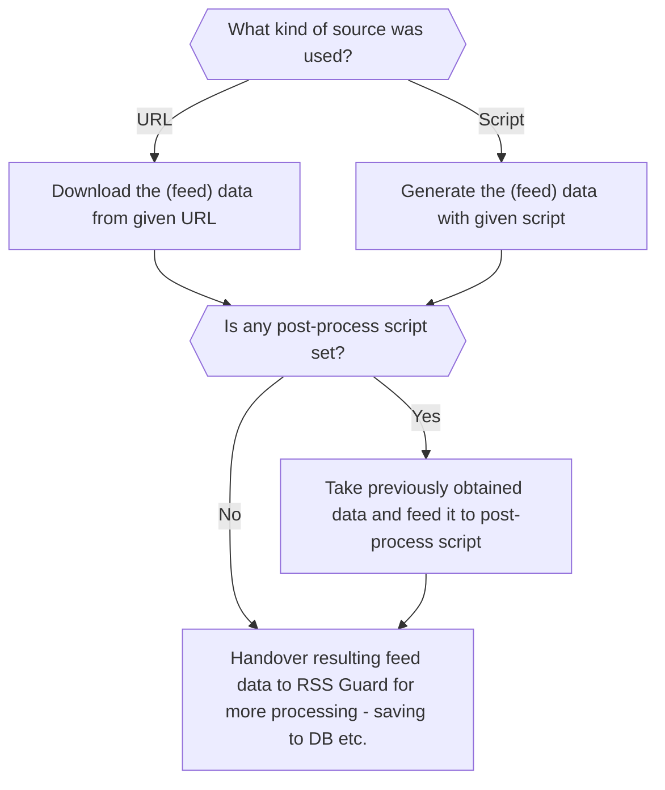

RSS Guard includes an advanced scraping feature inspired by [Liferea](https://lzone.de/liferea) that lets power users consume data sources which do not publish a regular feed. Instead of pointing RSS Guard at an existing RSS or Atom URL, you provide a script that generates valid feed data and writes it to standard output — RSS Guard takes that output and processes it exactly as it would a downloaded feed file.

<Warning>
Only proceed if you consider yourself a power user and know what you are doing.
</Warning>

## Feed source types

Each feed in RSS Guard can be configured with one of three source types:

| Source type | Behavior |
| :--- | :--- |
| **URL** | RSS Guard downloads the feed file from the given URL. This is the default behavior. |
| **Local file** | RSS Guard reads a file on the local filesystem as the feed source. |
| **Script** | RSS Guard runs a custom script and uses its standard output as the feed data. |

## Script source

When the **Script** source type is selected you cannot provide a feed URL. Instead, you supply an execution line for a script that produces valid feed data on [standard output (stdout)](https://en.wikipedia.org/wiki/Standard_streams#Standard_output_(stdout)). Any errors in the script must be written to [standard error (stderr)](https://en.wikipedia.org/wiki/Standard_streams#Standard_error_(stderr)).

The **Fetch it now** button works with the Script source type. If your source script and optional post-process script together produce valid feed data, RSS Guard can auto-discover metadata such as the feed title and icon.

If everything succeeds, the script must exit with code `0`. A non-zero exit code signals an error.

### The `%data%` placeholder

RSS Guard provides the placeholder `%data%` in script execution lines. It is automatically replaced with the full path to the RSS Guard user data folder, so you can reference files stored there without hard-coding absolute paths.

<Note>
The working directory of the process executing the script is set to the RSS Guard user data folder.
</Note>

### Path quoting and escaping

<Warning>
If your path to an executable contains backslashes as directory separators, escape each one with another backslash. Quote each individual argument with double quotes `"arg"` or single quotes `'arg'` and separate all arguments with spaces. Inside a double-quoted argument, escape any embedded double quote like `"arg with \"quoted\" part"`.

Valid examples (one per line):

```
C:\\MyFolder\\My.exe "arg1" "arg2" "my \"quoted\" arg3" 'my "quoted" arg4'

bash "%data%/scripts/download-feed.sh"

%data%\jq.exe '{ version: "1.1", title: "Stars", items: map( . | .title=.full_name | .content_text=.description | .date_published=.pushed_at)}'
```
</Warning>

## Post-process scripts

After the source feed data is obtained — either from a URL download or from a source script — you can optionally pass it through a second **post-process script**. The post-process script receives the raw source data as its standard input and must produce valid feed data on its standard output.

Typical uses for post-process scripts include CSS formatting, content localization, full-article downloading, custom filtering, or ad removal. You are free to split your logic however you like: a single source script, a single post-process script, or any combination where different source scripts feed the same post-process script and vice versa.

## Dataflow

The following flowchart illustrates when each script is invoked:



## Examples

The RSS Guard repository contains a collection of ready-to-use [website scrapers](https://github.com/martinrotter/rssguard/tree/master/resources/scripts/scrapers). Most are written in Python 3 and can be run with an execution line similar to:

```bash
python "script.py"
```

Examine each script for specific usage instructions.

## Third-party tools

<CardGroup cols={2}>
  <Card title="CSS2RSS" href="https://github.com/Owyn/CSS2RSS">
    Scrape websites using CSS selectors and produce RSS-compatible output.
  </Card>
  <Card title="RSSGuardHelper" href="https://github.com/pipiscrew/RSSGuardHelper">
    Another CSS-selector-based scraping helper designed to work with RSS Guard.
  </Card>
</CardGroup>
